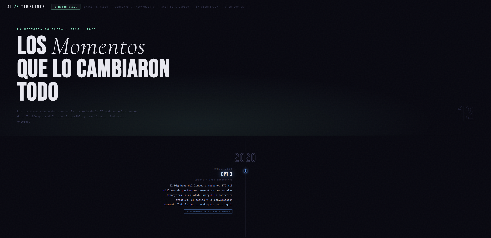

<div align="center">



<br/>

# AI // Timelines

**Historia interactiva de la Inteligencia Artificial · 2020 — 2025**

<br/>

[](.)
[](.)
[](.)
[](.)
[](.)

<br/>

</div>

---

## ¿Qué es esto?

Un timeline visual e interactivo que recorre los modelos, momentos y personas que han definido la historia de la IA moderna — desde **GPT-3** (2020) hasta **Claude 3.7 Sonnet** (2025).

**6 timelines temáticas** navegables desde el header, diseñadas para ser fácilmente ampliables:

| | Timeline | Contenido |
|---|---|---|
| ★ | **Hitos Clave** | Los 12 momentos más importantes de toda la historia |
| 🎨 | **Imagen & Vídeo** | DALL·E → Midjourney → Sora → Veo 2 |
| 💬 | **Lenguaje & Razonamiento** | GPT-3 → ChatGPT → Grok → Claude → o1 |
| 🤖 | **Agentes & Código** | Copilot → Auto-GPT → Devin → Claude Code |
| 🔬 | **IA Científica** | AlphaFold → Nobel de Física y Química → Fusión Nuclear |
| 🔓 | **Open Source** | Stable Diffusion → LLaMA → Grok-1 → DeepSeek |

---

## Características

- **Data-driven** — todo el contenido vive en un único archivo `data/timelines.js`. Añadir una IA nueva es añadir un objeto JS.
- **Sin frameworks, sin build tools, sin dependencias** — HTML + CSS + JS puro. Funciona abriendo `index.html` directamente.
- **Animaciones por scroll** — los eventos aparecen al entrar en el viewport con `IntersectionObserver`.
- **Responsive** — layout de dos columnas en desktop, una columna en móvil.
- **Escalable** — añadir una categoría nueva requiere editar solo 3 líneas de CSS y un objeto JS.

---

## Uso rápido

Sin instalación. Sin `npm install`. Sin nada.

```bash
# Opción A — abrir directamente
open index.html

# Opción B — servidor local con Python
python3 -m http.server 8080
# → http://localhost:8080

# Opción C — servidor local con Node
npx serve .
# → http://localhost:3000
```

---

## Estructura del proyecto

```
ai-timelines/
│
├── index.html              ← Shell HTML mínimo. No necesitas editarlo.
│
├── styles.css              ← Todos los estilos, organizados por secciones.
│                             Edita aquí colores, tipografía y responsive.
│
├── app.js                  ← Lee los datos y renderiza el DOM dinámicamente.
│                             No necesitas editarlo salvo cambios de lógica.
│
├── data/
│   └── timelines.js        ← ✅ EL ÚNICO ARCHIVO QUE NECESITAS EDITAR
│                             Aquí viven todas las categorías y sus eventos.
│
├── docs/                   ← Capturas para el README
│   └── preview-*.png
│
└── README.md
```

> **Regla de oro:** todo el contenido vive en `data/timelines.js`. El resto del código es infraestructura.

---

## Añadir una nueva IA a una categoría existente

Abre `data/timelines.js`, encuentra la categoría donde quieres añadirla y agrega un objeto al array `events`:

```js
// En la categoría correspondiente dentro de data/timelines.js:

{
  year:      2025,                       // número — agrupa bajo el año correcto
  date:      'Abril 2025',               // string — se muestra en la tarjeta
  title:     'Gemini 2.0 Ultra',         // nombre del modelo o evento
  sub:       'Google DeepMind — ...',    // empresa + descripción breve
  desc:      'Texto de 2 a 4 frases. Qué hace este modelo y por qué importa.',
  tag:       'Etiqueta corta de impacto',
  accent:    '#a29bfe',                  // color del nodo, hover y tag
  milestone: true,                       // opcional — añade efecto de brillo
},
```

> El layout izquierda/derecha **se alterna automáticamente**. Los eventos se ordenan por `year`.

---

## Añadir una nueva categoría completa

Solo necesitas tocar **dos archivos**: `data/timelines.js` y `styles.css`.

### 1. Añade la categoría en `data/timelines.js`

```js
// Al final del array TIMELINES, en data/timelines.js:

{
  id:        'robotics',                  // id único — sin espacios, sin mayúsculas
  label:     'Robótica',                  // texto del botón en el header
  eyebrow:   'Robots · Movimiento · Mundo Físico',
  titleHtml: 'La IA que<br><span class="it">Se Mueve</span>',
                                          // HTML permitido — .it aplica cursiva
  desc:      'Descripción del hero que aparece bajo el título principal.',
  color:     'var(--c-robotics)',         // variable CSS que definirás en el paso 2
  rgbColor:  '255,200,100',              // mismos valores RGB, para el gradiente del hero
  events: [
    // tus eventos aquí — mismo esquema de objeto que el punto anterior
  ],
},
```

### 2. Añade la variable de color en `styles.css`

```css
/* En :root — sección 1, junto al resto de --c-* */
--c-robotics: #ffc864;
```

### 3. Añade el estilo del botón activo en `styles.css`

```css
/* En la sección 3 "HEADER & NAVIGATION" */
.nav-btn[data-section="robotics"].active {
  color: var(--c-robotics);
  border-color: rgba(255,200,100,0.4);
}
```

**Listo.** La categoría aparecerá en el header y tendrá su propio hero, timeline y animaciones.

---

## Esquema completo de un evento

```js
{
  // ── Campos obligatorios ───────────────────────────────
  year:      2024,                 // number  — año (solo para agrupar, no se muestra)
  date:      'Marzo 2024',         // string  — fecha visible en la tarjeta
  title:     'Nombre del modelo',  // string  — título grande (Bebas Neue)
  sub:       'Empresa — detalle',  // string  — subtítulo en cursiva
  desc:      'Impacto en 2-4...',  // string  — cuerpo de la tarjeta
  tag:       'Etiqueta corta',     // string  — badge inferior con borde
  accent:    '#54a0ff',            // string  — color (hex, rgba, var(--c-xxx))

  // ── Campos opcionales ─────────────────────────────────
  milestone: true,                 // boolean — brillo en título y nodo del timeline
}
```

---

## Personalización visual

`styles.css` está dividido en **13 secciones** comentadas. Los cambios más habituales:

| Qué cambiar | Sección en styles.css |
|---|---|
| Colores globales (fondo, texto, bordes) | `1. CSS Variables` |
| Colores de categoría | `1. CSS Variables` → `:root` |
| Fuente del header y títulos grandes | `3. Header` y `9. Event Card` |
| Altura del hero | `5. Hero` → `.hero { min-height }` |
| Espaciado entre eventos | `9. Event Card` → `.tl-event { margin-bottom }` |
| Breakpoint mobile | `13. Responsive` |

---

## Arquitectura técnica

```
index.html
  │
  ├─ styles.css                    cargado en <head>
  │
  ├─ data/timelines.js             define el array global TIMELINES[]
  │
  └─ app.js                        lee TIMELINES y construye el DOM
       │
       ├─ render.buildHeader()     → inyecta <header> en #app-header
       │
       ├─ render.buildSection()    → crea cada <section> del DOM
       │    ├─ render.buildHero()
       │    └─ render.buildTimeline()
       │         └─ render.buildEvent() × N  ← un nodo por evento
       │
       ├─ nav_module.switchTo(id)  → gestiona transiciones entre secciones
       │
       └─ IntersectionObserver     → anima cada elemento al entrar en viewport
```

**Flujo de datos:**
```
data/timelines.js  →  TIMELINES[]  →  app.js render  →  DOM  →  CSS animations
```

---

<div align="center">
  <sub>Vanilla HTML · CSS · JS &nbsp;·&nbsp; Sin frameworks &nbsp;·&nbsp; Sin build tools &nbsp;·&nbsp; Sin dependencias</sub>
</div>